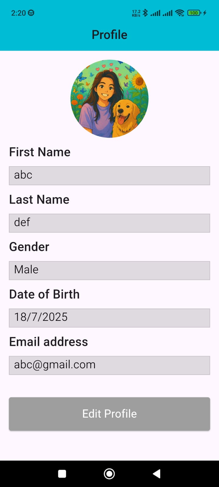
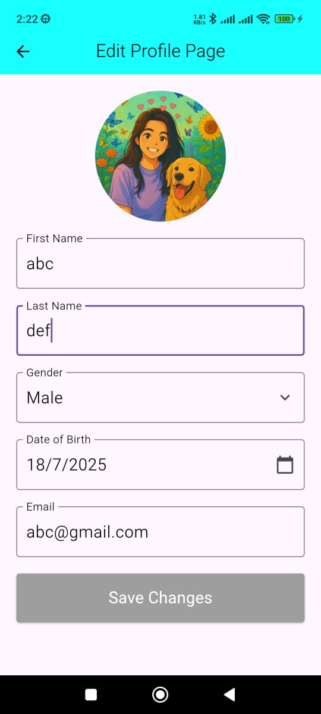

# 👤 Personal Profile App

A simple and responsive Flutter application for managing user profile data with image upload, local storage using `SharedPreferences`, and intuitive UI.

---

## ✨ Features

- Edit & view personal profile
- Image upload using camera or gallery
- Save data locally with `SharedPreferences`
- Formatted date picker for DOB
- Gender selection via dropdown
- Profile preview on the Home screen

---

## 📱 Screens

| Screen         | Description                       |
|----------------|-----------------------------------|
| **HomePage**   | Shows saved user profile          |
| **EditProfile**| Lets users update their profile   |

---

## 📂 Project Structure

```
lib/
├── main.dart
├── home_page.dart
├── edit_profile.dart
assets/
└── new.png
```

## 📸 Screenshots

### 🏠 Home Page


### ✏️ Edit Profile Page


